# APC523PS3
## Introduction
- Github repository for assignment 4 in APC523 is here: <a href = "https://github.com/ZINZINBIN/APC523PS4">https://github.com/ZINZINBIN/APC523PS4</a>
- Problem 1-(a), Problem 2, Problem 3-(a), and 3-(b) are noted as handwriting. The solution is uploaded via handwriting.pdf.

<!-- 
 -->

## Problem 1. Eliptic BVP
### Problem 1.a
The detailed derivation of the reformulation of the BVP in equation (1) as a root-finding problem is noted on handwriting.pdf. Briefly, the laplacian operator is now discretized so that it can be treated as a linear operator. The right hand side of the laplace equation is $u^4$, Therefore, we can define nonlinear function $g(u) = Lu - u^4$, where $u \in R^{N_{mesh}^2}$. Then, it is allowed to use Newton-Rapson method to compute the root with given Jacobian of $g(u)$.

### Problem 1.b
In this problem, the Newton-Rapson method with LU decomposition and 5-point second order discretized laplacian is applied. LU decomposition is used to compute the inverse matrix of Jacobian for each step. Considering the Dirichlet boundary condition, we added the boundary value after computing the residual $g(u)$ by $\frac{1}{h^2}$. The numerical result of $u(x,y)$ with directly computing the inverse of Jacobian is given below.

    

        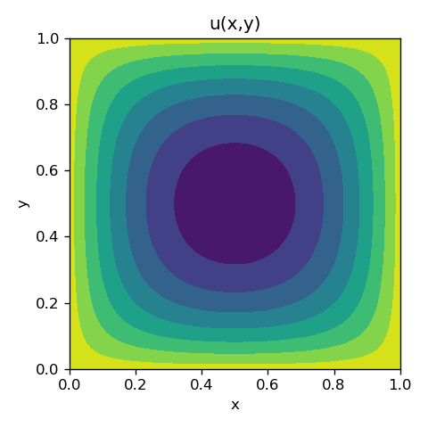
    

### Problem 1.c
As a iterative method to compute the inverse of Jacobian for $g(u)$, weighted Jacobi method was originally utilized and we could observe that this method can also find the solution. However, if the size of the mesh become larger, the computational cost and memory required is also larger so that our resources is not enough then. Therefore, we instead use scipy.sparse matrix and functions with generalized minimal residual iteration to get $J^{-1}g(u)$ direclty from solving $Jx = g(u)$, instead of solving $J^{-1}$ and then multipying $g(u)$. The convergence criteria for computing $J^{-1}g(u)$ is $10^{-8}$ with $N_{iter} = 16$. Then, all the iterative processes are set as $N_{epoch} = 64$. In this problem, $N_{mesh} = 64, 128, 256$ are given. The below figure shows the contour plot of the solution with different mesh size.

    

        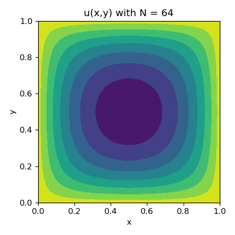
        
        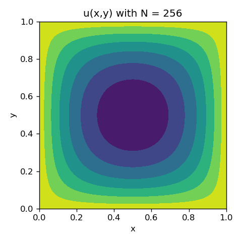
        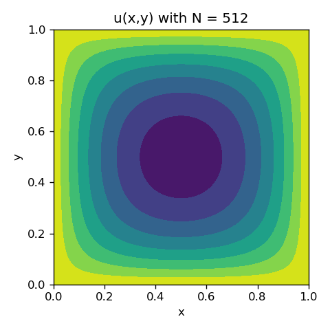
    

The L2 norm error between the above computed $u(x,y)$ and the ground-truth $u(x,y)$ with $N_{mesh} = 512$ as a function of $N_{mesh}$ is given below. We can observe that the L2 norm error is proportional to $\frac{1}{N^2}$, which can be checked by log-scale graph. 

    

        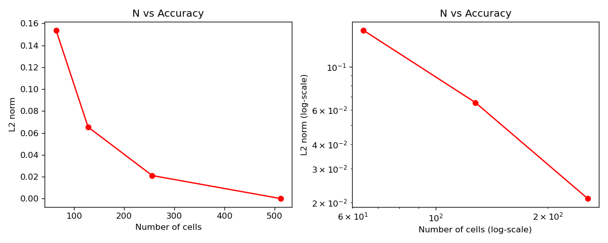
    

## Problem 2. Beam-warming Scheme
The detailed derivation of the modified equation for the Beam-warming scheme is noted on handwriting.pdf. Please see the attached file.

## Problem 3. Advection
### Problem 3.a and b
The handwriting solution for proving the analytical solution of $u(t,x,y)$ and the Corner Transport Upstream (CTU) method are derived on handwriting.pdf. Please see the attached file.

### Problem 3.c
In this problem, CTU and Lax-Wendroff method are implemented based on the equation derived on (b) and (c). The time difference is defined as $dt:= \frac{ C_{CFL}}{a/dx + b/dy}$ during the simulation to guarantee the numerical stability. The coefficient $C_{CFL}$ is set as 0.4, and other parameters including $a$, $b$ are set as given in the statement. Following the statement, we plot the contour for each case with different resolutions at $t = 1.0, 10.0$. 

The contour plots of $u(t=1.0,x,y)$ and $u(t=10.0,x,y)$ with $N = 128$ is given below. 
-  $u_{128}(t=1.0,x,y)$ 

    

        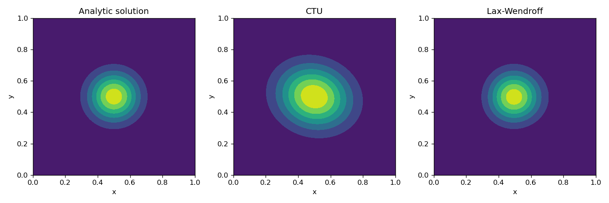
    

-  $u_{128}(t=10.0,x,y)$ 

    

        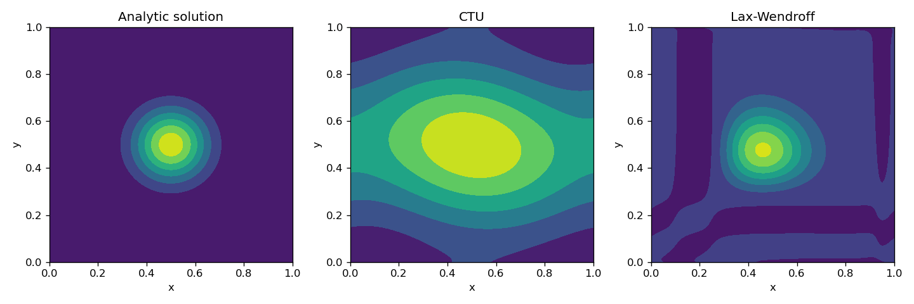
    

The contour plots of $u(t=1.0,x,y)$ and $u(t=10.0,x,y) $with $N = 256$ is given below. 

-  $u_{256}(t=1.0,x,y)$ 

    

        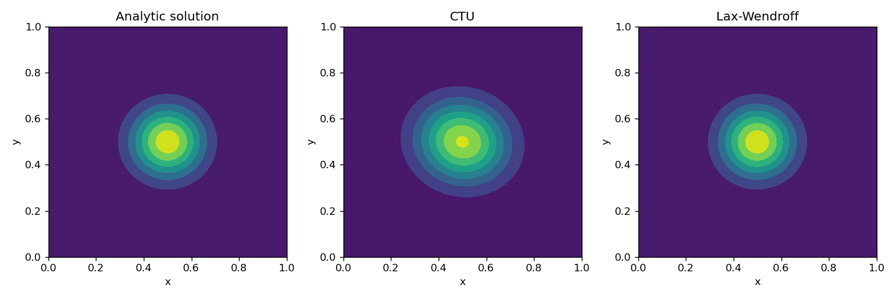
    

-  $u_{256}(t=10.0,x,y)$ 

    

        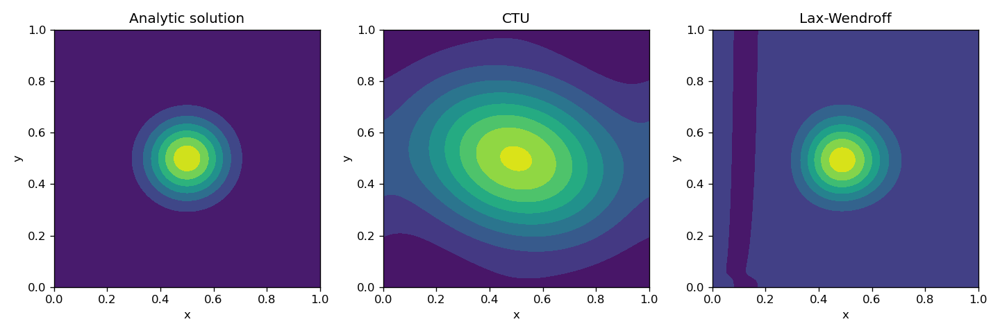
    

The contour plots of $u(t=1.0,x,y)$ and $u(t=10.0,x,y) $with $N = 512$ is given below. 

-  $u_{512}(t=1.0,x,y)$ 

    

        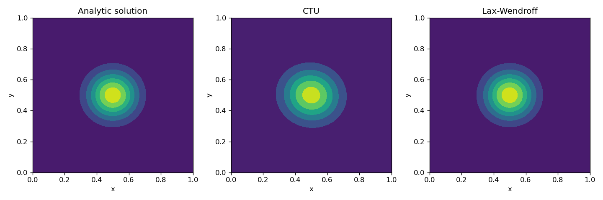
    

-  $u_{512}(t=10.0,x,y)$ 

    

        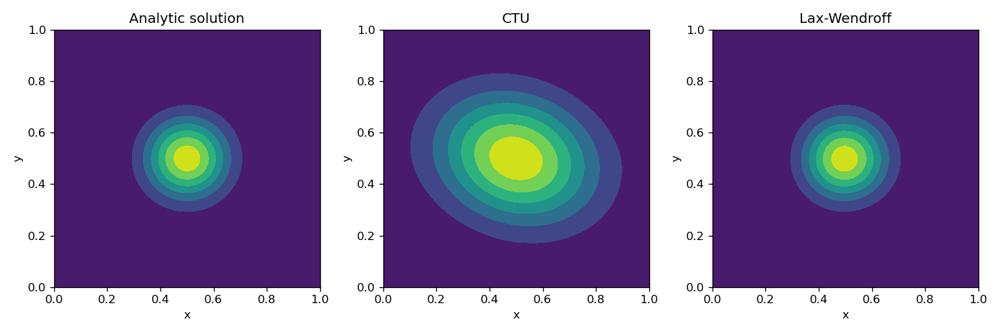
    

Lastly, the numerical result for L2 norm of the error as a function of time for $u(t,x,y)$ with different resolutions is given below.

    

        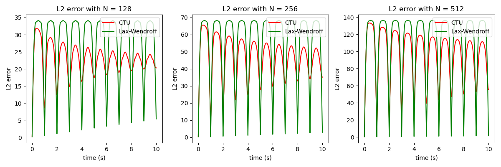
    

