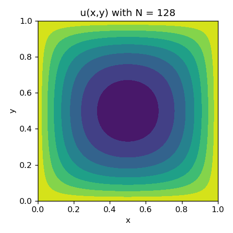

# APC523PS3
## Introduction
- Github repository for assignment 4 in APC523 is here: <a href = "https://github.com/ZINZINBIN/APC523PS4">https://github.com/ZINZINBIN/APC523PS3</a>
- Problem 2, Problem 3-(a), and 3-(b) are noted as handwriting. The solution is uploaded via handwriting.pdf.

## Problem 1. Eliptic BVP
### Problem 1.a
The derivation of the reformulation of the BVP in equation (1) as a root-finding problem is noted on handwriting.pdf.

### Problem 1.b

    

        
    

### Problem 1.c

    

        
        
        
    

    

        
    

## Problem 2. Beam-warming Scheme
The derivation of the modified equation for the Beam-warming scheme is noted on handwriting.pdf.

## Problem 3. Advection
### Problem 3.a and b
The solution for proving the analytical solution of $u(t,x,y)$ and the Corner Transport Upstream (CTU) method are derived on handwriting.pdf.

### Problem 3.c

    

        
    

    

        
    

    

        
    

    

        
    

    

        
    

    

        
    

    

        
    

